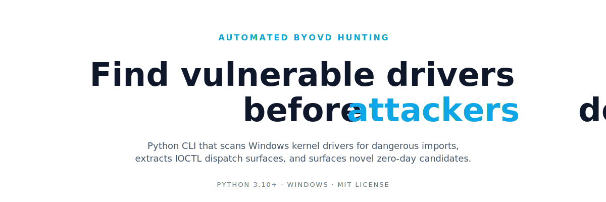

<p align="center">
  
</p>

# DriverScope


**Automated BYOVD hunting pipeline.** Scans Windows kernel drivers for dangerous imports, extracts IOCTL dispatch surfaces, cross-references against [LOLDrivers](https://www.loldrivers.io/) / [MS Blocklist](https://aka.ms/VulnerableDriverBlockList) / [KDU](https://github.com/hfiref0x/KDU), and surfaces novel zero-day candidates not yet in any public database.

Python 3.10+, Windows. MIT-licensed.

---

## Install

```bash
pip install git+https://github.com/diabloidyobane/DriverScope.git
pip install capstone   # optional, better IOCTL extraction
```

## Quick start

```bash
# scan your system drivers
driverscope scan C:\Windows\System32\drivers --lol --ioctl

# full zero-day hunt
driverscope hunt --deep --export findings.json

# extract IOCTLs from a specific driver
driverscope ioctl suspicious.sys --json
```

---

## Live PoC

Actual output from `C:\Windows\System32\drivers` on a Windows 11 host:

```
$ driverscope scan C:\Windows\System32\drivers

  SCAN RESULTS — 423 flagged / 463 total (40 clean)

  dxgkrnl.sys       14  x64  YES  PhysMem-Map, MSR, PCI-Config, Token-Priv +10
  cldflt.sys        10  x64       CrossProc-Attach, PhysMem-Map, Process-Lookup +7
  storport.sys      10  x64  YES  PhysMem-Map, PhysMem-Section, MDL +7
  acpi.sys           9  x64  YES  MSR, PCI-Config, PhysMem-Map +6
  ntfs.sys           9  x64  YES  PhysMem-Map, PhysMem-Unmap, Token-Priv +6
  tcpip.sys          9  x64  YES  Callback-Bypass, CrossProc-Attach +7
  ... 417 more
```

```
$ driverscope ioctl bam.sys

  bam.sys
  SHA256: dcf689b7...a5e314c3
  Method: capstone
  Dispatcher RVA: 0x11920
  IOCTLs found: 2

  0x00000004 METHOD_BUFFERED
    → IoThreadToProcess
  0x00000003 METHOD_NEITHER
    → ExAcquirePushLockExclusiveEx
    → KeEnterCriticalRegion
```

```
$ driverscope ioctl acpi.sys

  acpi.sys
  Method: brute
  IOCTLs found: 34

  0xfffc4e95 METHOD_IN_DIRECT
  0xfffc4e94 METHOD_BUFFERED
  0xfffc4eb3 METHOD_NEITHER
  0xfffc4ca2 METHOD_OUT_DIRECT
  ... 30 more
```

---

## 18 Primitive Classes

Every flagged import maps to a kernel primitive that BYOVD attacks exploit:

| Class | Example Import |
|---|---|
| **PhysMem-Map** | `MmMapIoSpace` |
| **PhysMem-Unmap** | `MmUnmapIoSpace` |
| **PhysMem-Section** | `ZwMapViewOfSection` |
| **PhysMem-Copy** | `MmCopyMemory` |
| **CrossProc-VA** | `ZwReadVirtualMemory` |
| **CrossProc-Attach** | `KeStackAttachProcess` |
| **Process-Lookup** | `PsLookupProcessByPid` |
| **CR-Regs** | `__readcr0`, `__writecr0` |
| **MSR** | `__readmsr`, `__writemsr` |
| **Debug-Regs** | `__readdr` |
| **KernelAlloc** | `ExAllocatePoolWithTag` |
| **KernelExec** | `MmAllocateContiguous` |
| **I/O-Port** | `READ_PORT_UCHAR` |
| **PCI-Config** | `HalGetBusData` |
| **Interrupt** | `HalSetSystemInformation` |
| **Registry** | `ZwSetValueKey` |
| **Token-Priv** | `SePrivilegeCheck` |
| **Callback-Bypass** | `CmUnRegisterCallback` |

---

## Subcommands

| Command | What it does |
|---|---|
| `scan` | Scan .sys files for dangerous kernel imports |
| `ioctl` | Extract IOCTL dispatch surface from a driver |
| `hunt` | Full-system zero-day hunting pipeline |
| `harvest` | Download OEM tools and extract embedded drivers |
| `regional` | Search LOLDrivers by regional vendor (CN/KR/JP/TW/RU) |
| `wdm` | Filter for WDM drivers with physmem primitives |

### All options

```bash
driverscope scan driver.sys                      # scan one file
driverscope scan C:\drivers --lol --blocklist    # scan dir + cross-ref
driverscope scan C:\drivers --ioctl              # scan + extract IOCTLs
driverscope scan C:\drivers --ioctl --json       # full JSON output
driverscope scan C:\drivers --export out.json    # write results to file
driverscope hunt                                 # zero-day hunt (System32\drivers)
driverscope hunt --deep --export hits.json       # include DriverStore + Program Files
driverscope ioctl driver.sys                     # extract IOCTL codes (single file)
driverscope ioctl C:\drivers --hits-only         # batch directory, skip empty
driverscope harvest --output ./harvested --scan  # download OEM tools, extract + scan
driverscope regional --region CN,JP              # LOLDrivers by vendor region
driverscope wdm C:\drivers                       # WDM-only physmem filter
```

### VirusTotal

```bash
export VT_API_KEY=your_key
driverscope scan C:\drivers --vt
```

Cached locally (30-day TTL), auto-throttles to free tier.

---

## How the hunt works

1. Collect .sys files from system dirs or custom paths
2. Parse PE imports, classify into 18 primitive categories
3. Filter out drivers already in LOLDrivers, MS Blocklist, or KDU
4. Filter out MS inbox drivers
5. Score remaining by primitive weights + signed/x64/IOCTL bonuses
6. Report top candidates with SHA256, signer, device names, IOCTLs

## Modules

- `scanner.py` — PE import scanner, VT/LOLDrivers/Blocklist integration
- `ioctl.py` — static IOCTL dispatch extraction (Capstone + bytescan)
- `hunter.py` — zero-day pipeline with novelty scoring
- `harvester.py` — OEM tool downloader + .sys extractor
- `regional.py` — regional vendor search (CN/KR/JP/TW/RU)
- `wdm_filter.py` — WDM vs KMDF filter
- `kdu.py` — KDU RMDX database parser

## Recommended: pair with Claude for triage

DriverScope surfaces candidates but doesn't reason about them. A useful workflow is to dump the JSON output (`--json` on any subcommand) along with the relevant decompilation, and ask **Claude Opus 4.6** (or any equivalent reasoning model) to triage:

- *"Does this IOCTL actually expose a write-what-where, or is it gated by a check I'm missing?"*
- *"Compare these handler imports to known LOLDrivers patterns — is this technique novel?"*
- *"What's the realistic exploit chain if I can call IOCTL `0xfffc4e94` on `acpi.sys`?"*

Claude Opus 4.6 handles long decompilation context well and is the default this was tested with.

### Hitting cyber safety blocks?

If you're doing legitimate vulnerability research and Claude's safety filters trip on a prompt (kernel exploit chains, BYOVD primitives, etc.), Anthropic has a **Cyber Verification Program** for safeguard adjustment:

> If you are experiencing cyber blocks on what you believe to be a legitimate use case under our Usage Policy, fill out this form to apply for safeguards adjustment under our Cyber Verification Program. (Organizations on Zero Data Retention are not currently eligible — contact your Anthropic Sales Representative.)

**Heads up — getting accepted is hard.** In practice, the program appears gated toward established orgs, vendors, and well-known names. Independent researchers (including ones with published CVEs to their name) have been turned down after multiple attempts. If you're in that bucket, your options are basically:

- Apply anyway — it costs nothing and policy may change
- Affiliate with a security org, vendor, or research lab that already has access
- Work the parts that don't trip safety filters (static triage, primitive classification, IOCTL surface mapping — exactly what DriverScope does) and keep exploit-chain reasoning local or with a different toolchain

This is being noted plainly so you don't burn a week assuming you'll get in.

Either way: **DriverScope finds the surface, the model helps you decide what's real.**

## Building a comm header to test findings

Once DriverScope hands you a list of IOCTL codes, you still need to actually call them from user-mode to confirm they reach a primitive. The pattern here is the same one used in commercial driver SDKs and security-research test rigs:

- **One C++ header per target driver** (`*_comm.h`)
- **`CTL_CODE(...)` macro per IOCTL** — self-documenting, not raw hex
- **One `struct` per IOCTL's input layout** — close to the call site so when you discover the layout is actually `{phys, size, virt}` instead of `{addr, len, _}` you change it in exactly one place
- **A wrapper class** with RAII handle cleanup and one typed method per IOCTL
- **A generic `Invoke()`** for sweeping unknown codes

### Workflow

```bash
# 1. dump IOCTL surface
driverscope ioctl driver.sys --json > findings.json

# 2. seed the CTL_CODE macros from JSON
python examples/gen_comm_header.py findings.json > driver_comm.h

# 3. build the tester against your filled-in header
cl /EHsc examples/ioctl_tester.cpp        # MSVC
g++ examples/ioctl_tester.cpp -o ioctl_tester.exe -lstdc++ -static   # MinGW
```

Then edit `driver_comm.h` to fill in the parts DriverScope can't guess:

- **`DEVICE_PATH`** — DriverScope reports `device_names` when it can recover them. For stripped or runtime-created devices, look it up with WinObj, `objdir`, or by reading `IoCreateSymbolicLink` in IDA.
- **Per-IOCTL request structs** — DriverScope tells you which kernel APIs each handler imports (`MmMapIoSpace`, `READ_PORT_UCHAR`, etc.) so you know what *kind* of primitive it is, but the exact struct the handler reads from the input buffer is on you to reverse. Common shapes for reference:

| Primitive | Typical input struct |
|---|---|
| PhysMem-Map | `{ uint64 phys_addr; uint32 size; uint64 mapped_out; }` |
| PhysMem-Copy | `{ uint64 phys_src; uint64 size; uint8 out[N]; }` |
| MSR | `{ uint32 msr_index; uint64 value; }` |
| I/O-Port | `{ uint16 port; uint8 width; uint32 value; }` |
| CR-Regs | `{ uint32 reg_index; uint64 value; }` |
| PCI-Config | `{ uint8 bus; uint8 dev; uint8 fn; uint16 offset; uint32 value; }` |

### Templates

| File | What it is |
|---|---|
| [`examples/comm_template.h`](examples/comm_template.h) | C++ header pattern: per-IOCTL structs + `ExampleDriver` class with `Open()`, typed primitive wrappers (`ReadPhysical`, `ReadMsr`, `Probe`), generic `Invoke()` |
| [`examples/ioctl_tester.cpp`](examples/ioctl_tester.cpp) | Three modes — *structured sweep* (validate each typed primitive with known-good inputs like BIOS shadow + EFER read), *raw sweep* (try N codes from a base), *single call* |
| [`examples/gen_comm_header.py`](examples/gen_comm_header.py) | Generates `CTL_CODE` macros from `driverscope ioctl --json` output |

### How the validators work

The structured sweep in `ioctl_tester.cpp` shows the pattern for confirming a primitive really exists rather than just that the IOCTL code is *defined*:

- **PhysMem-Map** — ask the handler to copy out bytes from `0x000F0000` (the BIOS shadow region). On most hardware that's reliably readable, so if you get non-zero bytes back, the handler genuinely walked physical memory.
- **MSR** — read EFER (`0xC0000080`) and check that bit 11 (NXE) is set. NXE has been on since XP SP2, so a zero return means either the handler didn't actually `rdmsr` or it's lying to you.
- **Probe** — send a magic cookie and check the handler echoes back a status field. Confirms the handler reaches `IoCompleteRequest` with your buffer.

Add one of these per primitive class you find. The point is to distinguish "IOCTL code is wired" from "IOCTL code reaches a real primitive" — easy to confuse in static analysis alone.

### Safety

Every `DeviceIoControl` call hits ring 0. A bad struct layout against a physmem or MSR driver will BSOD instantly. **Test in a VM with a snapshot you can roll back**, never on a host you care about.

## Deeper IOCTL analysis with IDA

DriverScope's static IOCTL extractor handles most drivers, but complex dispatchers (deeply nested, obfuscated, or virtualized) benefit from IDA Pro's full analysis. Use [re-mcp-ida](https://github.com/mrexodia/ida-pro-mcp) in headless mode:

```bash
# start IDA headless with the MCP plugin on a driver
idat64 -A -S"ida_mcp_server.py --port 13337" -L"ida.log" driver.sys

# then point DriverScope at the IOCTL surface
driverscope ioctl driver.sys --json
```

Combine DriverScope's automated primitive classification with IDA's decompiler output to confirm what each IOCTL handler does before filing a report.

---

## Disclosure

If you find a novel vulnerable driver: report to the vendor and [MSRC](https://msrc.microsoft.com/) before publishing. Request addition to the [MS Blocklist](https://learn.microsoft.com/en-us/windows/security/application-security/application-control/app-control-for-business/design/microsoft-recommended-driver-block-rules). Submit to [LOLDrivers](https://www.loldrivers.io/) after vendor response.

## Support

If DriverScope saved you time or surfaced a useful finding, you can support development:

[](https://ko-fi.com/mrniceguy412)

## See also

- [LOLDrivers.io](https://www.loldrivers.io/)
- [KDU](https://github.com/hfiref0x/KDU)
- [IOCTLance](https://github.com/ioctlance/ioctlance)
- [DriverBuddy Revolutions](https://github.com/jsacco/driverbuddyrevolutions)

## Credits

- [@jsacco](https://github.com/jsacco) — [DriverBuddy Revolutions](https://github.com/jsacco/driverbuddyrevolutions), which informed parts of the IOCTL/dispatcher detection approach

## License

MIT
