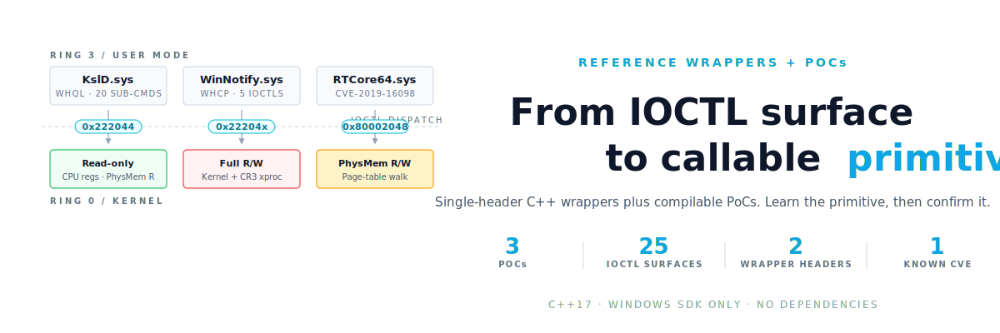

<p align="center">
  
</p>

# DriverScope


**Automated BYOVD hunting pipeline.** Scans Windows kernel drivers for dangerous imports, extracts IOCTL dispatch surfaces, cross-references against [LOLDrivers](https://www.loldrivers.io/) / [MS Blocklist](https://aka.ms/VulnerableDriverBlockList) / [KDU](https://github.com/hfiref0x/KDU), and surfaces novel zero-day candidates not yet in any public database.

Python 3.10+, Windows. MIT-licensed.

---

## Install

```bash
pip install git+https://github.com/diabloidyobane/DriverScope.git
pip install driverscope[disasm]    # capstone, better IOCTL extraction
pip install driverscope[emulate]   # Speakeasy driver emulation
pip install driverscope[cluster]   # TLSH fuzzy-hash clustering
pip install driverscope[bulk]      # Playwright + httpx for vendor scraping
pip install driverscope[triage]    # Claude API triage
pip install driverscope[all]       # everything above
```

## Quick start

```bash
# scan your system drivers
driverscope scan C:\Windows\System32\drivers --lol --ioctl

# full zero-day hunt
driverscope hunt --deep --export findings.json

# extract IOCTLs from a specific driver
driverscope ioctl suspicious.sys --json
```

---

## Live PoC

Actual output from `C:\Windows\System32\drivers` on a Windows 11 host:

```
$ driverscope scan C:\Windows\System32\drivers

  SCAN RESULTS: 423 flagged / 463 total (40 clean)

  dxgkrnl.sys       14  x64  YES  PhysMem-Map, MSR, PCI-Config, Token-Priv +10
  cldflt.sys        10  x64       CrossProc-Attach, PhysMem-Map, Process-Lookup +7
  storport.sys      10  x64  YES  PhysMem-Map, PhysMem-Section, MDL +7
  acpi.sys           9  x64  YES  MSR, PCI-Config, PhysMem-Map +6
  ntfs.sys           9  x64  YES  PhysMem-Map, PhysMem-Unmap, Token-Priv +6
  tcpip.sys          9  x64  YES  Callback-Bypass, CrossProc-Attach +7
  ... 417 more
```

```
$ driverscope ioctl bam.sys

  bam.sys
  SHA256: dcf689b7...a5e314c3
  Method: capstone
  Dispatcher RVA: 0x11920
  IOCTLs found: 2

  0x00000004 METHOD_BUFFERED
    -> IoThreadToProcess
  0x00000003 METHOD_NEITHER
    -> ExAcquirePushLockExclusiveEx
    -> KeEnterCriticalRegion
```

```
$ driverscope ioctl acpi.sys

  acpi.sys
  Method: brute
  IOCTLs found: 34

  0xfffc4e95 METHOD_IN_DIRECT
  0xfffc4e94 METHOD_BUFFERED
  0xfffc4eb3 METHOD_NEITHER
  0xfffc4ca2 METHOD_OUT_DIRECT
  ... 30 more
```

---

## 18 Primitive Classes

Every flagged import maps to a kernel primitive that BYOVD attacks exploit:

| Class | Example Import |
|---|---|
| **PhysMem-Map** | `MmMapIoSpace` |
| **PhysMem-Unmap** | `MmUnmapIoSpace` |
| **PhysMem-Section** | `ZwMapViewOfSection` |
| **PhysMem-Copy** | `MmCopyMemory` |
| **CrossProc-VA** | `ZwReadVirtualMemory` |
| **CrossProc-Attach** | `KeStackAttachProcess` |
| **Process-Lookup** | `PsLookupProcessByPid` |
| **CR-Regs** | `__readcr0`, `__writecr0` |
| **MSR** | `__readmsr`, `__writemsr` |
| **Debug-Regs** | `__readdr` |
| **KernelAlloc** | `ExAllocatePoolWithTag` |
| **KernelExec** | `MmAllocateContiguous` |
| **I/O-Port** | `READ_PORT_UCHAR` |
| **PCI-Config** | `HalGetBusData` |
| **Interrupt** | `HalSetSystemInformation` |
| **Registry** | `ZwSetValueKey` |
| **Token-Priv** | `SePrivilegeCheck` |
| **Callback-Bypass** | `CmUnRegisterCallback` |

---

## Subcommands

| Command | What it does |
|---|---|
| `scan` | Scan .sys files for dangerous kernel imports |
| `ioctl` | Extract IOCTL dispatch surface from a driver |
| `emulate` | Speakeasy emulation: trace DriverEntry, device names, PDB, debug strings |
| `hunt` | Full-system zero-day hunting pipeline |
| `harvest` | Download OEM tools and extract embedded drivers |
| `pipeline` | End-to-end orchestrator (harvest + scan + enrich + cluster + diff + dossier) |
| `regional` | Search LOLDrivers by regional vendor (CN/KR/JP/TW/RU) |
| `wdm` | Filter for WDM drivers with physmem primitives |
| `bulk` | Bulk-scrape vendor download portals via Playwright |
| `triage` | Bulk Claude API triage of scan/ioctl findings |
| `novel` | Check which scan results are absent from LOLDrivers |
| `fuzz` | Generate boofuzz IOCTL fuzzing harness for a driver |

### All options

```bash
driverscope scan driver.sys                      # scan one file
driverscope scan C:\drivers --lol --blocklist    # scan dir + cross-ref
driverscope scan C:\drivers --ioctl              # scan + extract IOCTLs
driverscope scan C:\drivers --ioctl --json       # full JSON output
driverscope scan C:\drivers --export out.json    # write results to file
driverscope hunt                                 # zero-day hunt (System32\drivers)
driverscope hunt --deep --export hits.json       # include DriverStore + Program Files
driverscope ioctl driver.sys                     # extract IOCTL codes (single file)
driverscope ioctl C:\drivers --hits-only         # batch directory, skip empty
driverscope emulate driver.sys                   # trace DriverEntry via Speakeasy
driverscope emulate C:\drivers --json            # batch emulate a directory
driverscope harvest --output ./harvested --scan  # download OEM tools, extract + scan
driverscope pipeline --all                       # full end-to-end hunt
driverscope novel findings.json                  # LOLDrivers novelty check
driverscope fuzz driver.sys --out harness.py     # generate fuzzing harness
driverscope regional --region CN,JP              # LOLDrivers by vendor region
driverscope wdm C:\drivers                       # WDM-only physmem filter
```

### Bulk vendor scraping

The `bulk` subcommand uses Playwright to scrape vendor download portals at scale. **55 vendors across 10 regions**: TW, HK, CN, KR, JP, RU, DE, US, IN, and multi-vendor global archives. Use it to build a corpus of vendor-signed drivers far outside what's already in LOLDrivers.

| Region | Vendors |
|---|---|
| **TW** (10) | MSI, ASRock, Gigabyte, Asus, Acer, Biostar, ECS, Realtek, Foxconn-TW, PowerColor |
| **HK** (2) | ZOTAC, Sapphire |
| **CN** (10) | Lenovo, Huawei, Xiaomi, Colorful, Yeston, Galax, Onda, Foxconn-CN, ZTE, MAXSUN |
| **KR** (3) | Samsung, LG, GIGABYTE-KR |
| **JP** (7) | Buffalo, IO-Data, Elecom, Logitec-JP, Sony, NEC, Panasonic |
| **RU** (5) | DriverPack, Driver.ru, DRP-Catalog, 4PDA, Yandex |
| **DE** (4) | BeQuiet, Endorfy, Fujitsu, Medion |
| **US** (7) | EVGA, XFX, Dell, HP, Intel-DSA, AMD, Nvidia |
| **IN** (1) | iBall |
| **global** (6) | Station-Drivers, MS Update Catalog, DriverGuide, TechSpot, CNET, MajorGeeks |

```bash
pip install driverscope[bulk]
playwright install chromium

driverscope bulk --list                              # 55 vendor targets, see above
driverscope bulk --region CN,KR,RU --scan            # crawl China + Korea + Russia, scan results
driverscope bulk --region JP --category laptop       # Japanese laptop vendors only
driverscope bulk --vendors DriverPack-RU,4PDA-Files  # RU aggregator focus
driverscope bulk --category gpu --output ./gpu_corpus
driverscope bulk --max-pages 10                      # deep crawl, all vendors
```

Output goes to `<output>/<vendor>/<file>`. Each vendor runs in parallel under a concurrency cap. Downloads cap at 200MB per file and skip files that already exist on disk (idempotent re-runs).

**Why regional matters for BYOVD hunting**: CN, KR, JP, and RU vendors ship signed drivers that rarely appear in English-language security research. Many never reach LOLDrivers because nobody English-speaking has looked. The same goes for OEM laptop manufacturers' bundled telemetry/overclock/fan-control drivers — signed, broad install base, often built by third-party contractors with no security review.

### Bulk Claude triage

After scan/ioctl extraction, pipe the JSON output through `triage` to get per-IOCTL verdicts from Claude:

```bash
pip install driverscope[triage]
export ANTHROPIC_API_KEY=sk-ant-...

driverscope scan ./corpus --ioctl --json --export findings.json
driverscope triage findings.json --output triage.md
```

Each finding produces:

```
IOCTL 0x80102040  CONFIRMED-PRIMITIVE  MmMapIoSpace exposed with no caller check
IOCTL 0x80102044  LIKELY-PRIMITIVE     PhysMem write reachable; bounds check is weak
IOCTL 0x80102048  GATED                Guarded by process-name allowlist
OVERALL: CONFIRMED-PRIMITIVE  Driver exposes arbitrary physical R/W via two IOCTLs
```

Triage runs concurrently (default 4 in flight). Use `--concurrency 8` if you have API capacity. Default model: `claude-opus-4-6`.

### Speakeasy emulation

The `emulate` subcommand uses [Mandiant Speakeasy](https://github.com/mandiant/speakeasy) to emulate DriverEntry without loading the driver. It traces kernel API calls, extracts device names, PDB paths, debug strings, and classifies primitives from runtime behavior that static import scanning alone can't reach.

```bash
pip install driverscope[emulate]

driverscope emulate driver.sys                   # single driver
driverscope emulate C:\drivers --json            # batch directory
driverscope emulate a.sys b.sys c.sys --export results.json
```

Real output from 4 drivers (0.6s total wall-clock):

```
  #  Driver                       Device                EPs Crash PDB                  Primitives
  -- ---------------------------- --------------------- --- ----- -------------------- ----------
  1  GlobalVistaVentures_v3.sys   GlobalVistaVentures     6       Kinkajou             CR-Regs, CrossProc-VA, PageTable-Walk, VAD-Inject +4
  2  signeddrv.sys                                        5       Windows-Memory-Info  CrossProc-VA, KernelMem-Copy, PhysMem-Map
  3  RTCore64.sys                 RTCore64                5                            PhysMem-Map, PhysMem-Section
  4  PawnIO.sys                   PawnIO                 15     4 PawnIO_unsigned      MSR-RW, PCI-Config, PhysMem-Direct, VirtMem-RW +1
```

What emulation finds that static import scanning doesn't:

- **Full driver lifecycle**: traces DriverEntry through IRP_MJ_CREATE, IRP_MJ_DEVICE_CONTROL, IRP_MJ_CLOSE, and DriverUnload, with API calls and return values per phase
- **BSOD crash detection**: PawnIO.sys has 4 crash sites where exported unregister functions dereference null at `[rdx + 8]` (invalid_read = kernel bugcheck on real hardware)
- **IoCreateDriver resolution**: drivers that create hidden driver objects via `IoCreateDriver` instead of normal `IoCreateDevice` registration are auto-resolved using Capstone to extract the MajorFunction table from the initialization callback
- **PDB paths**: reveal original project names and build infrastructure (Jenkins CI paths, dev machine directories)
- **Debug strings**: expose the full capability set in plain English (PawnIO's 37 named R/W operations, GlobalVistaVentures' VAD manipulation + page table walking)
- **Device names**: signeddrv uses `\Device\WinNotify` and references `\Driver\MouClass` (mouse input interception), invisible to import-only analysis
- **Runtime imports**: drivers that resolve APIs via `MmGetSystemRoutineAddress` instead of the import table (e.g. resolving `IoCreateDeviceSecure` at runtime instead of linking it)

Emulation runs at ~100ms per driver. It complements the `scan` and `ioctl` subcommands: `scan` catches the import table, `ioctl` maps the dispatch surface, `emulate` reveals everything the developer left in the binary's strings and initialization path.

### Pipeline orchestrator

The `pipeline` subcommand runs every stage in sequence: harvest vendor sources, build the local corpus, scan, enrich with LOLDrivers + MS Blocklist, simulate HVCI verdicts, cluster by TLSH similarity, diff against prior runs, and write a ranked markdown + HTML dossier.

```bash
driverscope pipeline --all                        # everything
driverscope pipeline --harvest --cluster --diff    # selective stages
driverscope pipeline --hvci-simulate --top 10      # HVCI filter + deeper dossier
driverscope pipeline --extra-root ./my_drivers     # custom corpus root
```

Results persist to a SQLite database. Each run records corpus size, hit count, and MS blocklist coverage. The diff stage compares the current scan against the most recent prior run and flags newly appeared or newly flagged drivers.

### Fuzzing harness generation

```bash
driverscope fuzz driver.sys --out harness.py
```

Generates a [boofuzz](https://github.com/jtpereyda/boofuzz) harness pre-populated with every IOCTL code from the driver's dispatch surface. Flagged IOCTLs (those whose handlers import dangerous APIs) get annotated fuzz blocks. Non-flagged IOCTLs are included but commented out by default (pass `--all` to activate them).

---

## Driver catalog

18 drivers, grouped by the kernel primitive each exposes: cross-process virtual memory R/W, physical memory R/W, or process termination. Real intrusions combine them: a termination driver stops the EDR agent, then a memory driver reads LSASS.

### Cross-process virtual memory R/W

Imports one of `MmCopyVirtualMemory`, `ZwReadVirtualMemory`, `ZwWriteVirtualMemory`. Attack shape: attach to another process by PID or handle, then read or write pages inside its virtual address space. No page-table walk, no physical memory. Enough for dumping credential material from `lsass.exe` or patching code inside a target process.

### Physical memory R/W

The largest group. Imports include `MmMapIoSpace`, `MmCopyMemory`, `ZwMapViewOfSection` against `\Device\PhysicalMemory`, or a CR3-based page-table walker built into the driver. KslD.sys sits here on the read side (`MmCopyMemory` with `MM_COPY_MEMORY_PHYSICAL`), WinNotify.sys covers kernel R/W plus CR3-based cross-process access, and RTCore64.sys (CVE-2019-16098) is the MSI Afterburner driver, on the MS Blocklist. Anything in this group bypasses HVCI's per-page R/W enforcement, because HVCI enforces on kernel virtual addresses, not on physical mappings that a signed driver holds.

### Process termination

One import: `ZwTerminateProcess`, or an equivalent open-and-kill IOCTL. That's enough to stop the userland half of an EDR agent: CrowdStrike's `CSFalconService.exe`, Defender's `MsMpEng.exe`, SentinelOne's `SentinelAgent.exe`. These drivers cannot map memory or write to kernel space on their own, so operators pair them with a memory-R/W driver in real intrusions.

### LOLDrivers tracking

Three physmem-R/W drivers from this catalog have landed in LOLDrivers since the initial analysis: TRIXX (physmem map), WDTKernel (physmem copy), CorsairLLAccess (I2C/SMBus physmem). Their entries now carry CVE numbers and blocklist hashes. `driverscope novel findings.json` runs the cross-check against the current LOLDrivers set at scan time.

---

## KDU provider classification

All 65 KDU providers classified by the kernel primitive each exploits. Most use `MmCopyVirtualMemory` for cross-process virtual memory R/W. A smaller set maps physical memory (`MmMapIoSpace`, `ZwMapViewOfSection`), and a handful exploit MSR access, PCI config, or debug register primitives.

Run `driverscope scan` with `--lol` to see which KDU providers overlap with your corpus.

---

<p align="center">
  
</p>

## Reference wrappers + PoCs

Single-header C++ IOCTL wrappers for two analyzed drivers, plus three compilable PoCs demonstrating the primitives end-to-end. Each header is self-contained (no dependencies beyond Windows SDK) and includes typed methods for every documented IOCTL.

### The three PoCs

| File | Driver | Primitive |
|---|---|---|
| [`examples/poc_ksld.cpp`](examples/poc_ksld.cpp) | KslD.sys | Read-only: CPU regs, KASLR bypass, physmem read, EPROCESS walk |
| [`examples/poc_winnotify.cpp`](examples/poc_winnotify.cpp) | WinNotify.sys | Full R/W: kernel read/write, CR3-based cross-process read, safe write proof |
| [`examples/poc_rtcore64.cpp`](examples/poc_rtcore64.cpp) | RTCore64.sys (CVE-2019-16098) | PhysMem R/W: 4-level page-table walk, EPROCESS walk via physical memory |

Build any of them with `cl /EHsc /std:c++17 examples/poc_XXX.cpp` or MinGW `g++`. Each PoC is safe by construction: every write primitive uses a read-modify-verify round-trip on a value it just read, no destructive kernel modification.

### KslD.sys (read-only)

[`examples/wrappers/KslD.h`](examples/wrappers/KslD.h) -- Microsoft WHQL-signed (Intel TDT internally). Single IOCTL `0x222044` with 20 sub-commands dispatched by a DWORD at input offset 0.

Key sub-commands:

| Sub-cmd | Primitive | Notes |
|---|---|---|
| 2 | CPU register dump | Returns RAX-R15, RIP, RFLAGS, segment regs. KASLR info leak. |
| 12 (mode=1) | Physical memory read | `MmCopyMemory` with `MM_COPY_MEMORY_PHYSICAL`. Chunks at 0x400 bytes. |
| 12 (mode=2) | Kernel VA read | `MmCopyMemory` with `MM_COPY_MEMORY_VIRTUAL`. Same chunking. |

Access gate: the driver checks a `AllowedProcessName` registry value under its service key. Set it to your process name before calling.

Wrapper provides: `Open`, `Close`, `GetCpuRegisters`, `ReadPhysical`, `ReadKernelVA`, `FindKernelBase` (IDTR scan), `FindExport`, `TranslateVA` (full 4-level page-table walk with large page and transition page support), `ReadProcessMemory`, `FindProcess`, `ReadProc<T>`, `SetAllowedProcess`.

### WinNotify.sys (full R/W)

[`examples/wrappers/WinNotify.h`](examples/wrappers/WinNotify.h) -- WHCP-signed (Aspect/R6 lineage). 5 IOCTLs. Full kernel + process memory R/W. No admin check on current builds.

| IOCTL | Primitive | Buffer layout |
|---|---|---|
| `0x22200C` | Module base lookup | Input: 8-byte driver index. Output: base address. |
| `0x222040` | Kernel read (5 QWORDs) | Input: VA. Output: 5 consecutive QWORDs from that address. |
| `0x222044` | Kernel write | Input: `{VA, size, data[]}`. Uses `memmove`. |
| `0x222000` | CR3-based read | Input: `{CR3, VA, size}`. Output: data at translated physical address. |
| `0x222004` | CR3-based write | Input: `{CR3, VA, size, data[]}`. Translates and writes. |

Wrapper provides: `Open`, `Close`, `GetModuleBase`, `KernelRead5`, `ReadKernelQWORD` (offset trick on 0x222040), `ReadKernelVA`, `WriteKernelVA`, `Cr3Read`, `Cr3Write`, `ReadProcessMemory`, `WriteProcessMemory`, `FindProcess` (EPROCESS walk with auto-detect PID/ImageFileName/ActiveProcessLinks offsets), `ReadProc<T>`, `WriteProc<T>`.

### IDT hijack (downstream technique)

WinNotify's kernel write primitive enables IDT (Interrupt Descriptor Table) hijacking as documented by Exploit Pack. The attack replaces an IDT entry's handler pointer with a shellcode address, then triggers that interrupt from user mode. Under VBS/HVCI/kCET, the IDT lives in read-only memory and the ISR must be a valid signed code page. WinNotify's `memmove`-based write bypasses this because it executes in kernel context on the driver's own code pages, which are already signed and loaded.

### VirusTotal

```bash
export VT_API_KEY=your_key
driverscope scan C:\drivers --vt
```

Cached locally (30-day TTL), auto-throttles to free tier.

---

## How the hunt works

1. Collect .sys files from system dirs or custom paths
2. Parse PE imports, classify into 18 primitive categories
3. Filter out drivers already in LOLDrivers, MS Blocklist, or KDU
4. Filter out MS inbox drivers
5. Score remaining by primitive weights + signed/x64/IOCTL bonuses
6. Report top candidates with SHA256, signer, device names, IOCTLs

## Modules (29)

**Core analysis**

| Module | Description |
|---|---|
| `scanner` | PE import scanner, VT/LOLDrivers/Blocklist enrichment, hunt scoring |
| `ioctl` | Static IOCTL dispatch extraction (Capstone + bytescan) |
| `emulate` | Speakeasy DriverEntry tracing, string/PDB/device extraction |
| `hunter` | Zero-day pipeline with novelty scoring |
| `kdu` | KDU RMDX database parser (65 providers classified) |

**Harvesting (65+ vendor targets)**

| Module | Description |
|---|---|
| `harvester/` | OEM tool downloader + .sys extractor (base 10 sources) |
| `harvester/oem` | 24 OEM BIOS/firmware tool sources (Dell, HP, Lenovo, ASUS, MSI, Gigabyte, ASRock, Biostar, AMI, Insyde, Phoenix) |
| `harvester/rgb` | RGB/AIO/OC panel sources (Corsair iCUE, Razer Synapse, NZXT CAM, etc.) |
| `harvester/storage` | Storage controller utility sources |
| `harvester/sysinfo` | System info tool sources |
| `harvester/bmc` | BMC/IPMI management tool sources |
| `harvester/cn` | Chinese vendor tool sources |
| `harvester/vpn` | VPN client sources with kernel drivers |
| `winget_walk` | winget catalog walker, auto-extracts .sys from installers |
| `bazaar` | MalwareBazaar + MalShare .sys pivot harvesting |
| `wayback` | Wayback Machine snapshot enumeration for old driver versions |
| `vxug` | VX-Underground archive harvesting |
| `aipan` | 爱盘 (down.52pojie.cn) driver archive harvesting |
| `cn_forums` | Kanxue + 52pojie thread scraper |
| `browser_harvest` | Browser-based harvesting for JS-gated vendor portals |
| `bulk_scrape` | Playwright-based vendor portal scraping (55 vendors, 10 regions) |
| `regional` | LOLDrivers search filtered by vendor region (CN/KR/JP/TW/RU) |

**Analysis and enrichment**

| Module | Description |
|---|---|
| `db` | SQLite scan history with append-only schema |
| `corpus` | Local corpus builder (system dirs, DriverStore, custom roots) |
| `diff` | Diff two scan snapshots (new/removed/changed drivers) |
| `hvci` | Offline WDAC/HVCI policy evaluation |
| `tlsh_cluster` | TLSH fuzzy-hash clustering vs LOLDrivers-known hashes |
| `find_novel` | Novelty check against LOLDrivers |
| `wdm_filter` | WDM vs KMDF filter |
| `pdb_resolver` | Microsoft symbol server PDB fetcher |
| `fuzz_gen` | boofuzz IOCTL fuzzing harness generator |
| `html_dossier` | HTML hunt dossier renderer |
| `pipeline` | End-to-end orchestrator (all stages in sequence) |
| `triage` | Claude API bulk triage |

## Recommended: pair with Claude for triage

DriverScope surfaces candidates but doesn't reason about them. A useful workflow is to dump the JSON output (`--json` on any subcommand) along with the relevant decompilation, and ask **Claude Opus 4.6** (or any equivalent reasoning model) to triage:

- *"Does this IOCTL expose a write-what-where, or is it gated by a check I'm missing?"*
- *"Compare these handler imports to known LOLDrivers patterns. Is this technique novel?"*
- *"What's the exploit chain if I can call IOCTL `0xfffc4e94` on `acpi.sys`?"*

Claude Opus 4.6 handles long decompilation context well and is the default this was tested with.

### Hitting cyber safety blocks?

If you're doing legitimate vulnerability research and Claude's safety filters trip on a prompt (kernel exploit chains, BYOVD primitives, etc.), Anthropic has a **Cyber Verification Program** for safeguard adjustment:

> If you are experiencing cyber blocks on what you believe to be a legitimate use case under our Usage Policy, fill out this form to apply for safeguards adjustment under our Cyber Verification Program. (Organizations on Zero Data Retention are not currently eligible. Contact your Anthropic Sales Representative.)

**Getting accepted is hard.** In practice, the program is gated toward established orgs, vendors, and well-known names. Independent researchers (including ones with published CVEs) have been turned down after multiple attempts. If you're in that bucket, your options:

- Apply anyway. It costs nothing and policy may change.
- Affiliate with a security org, vendor, or research lab that already has access.
- Work the parts that don't trip safety filters (static triage, primitive classification, IOCTL surface mapping). Keep exploit-chain reasoning local or with a different toolchain.

Noted up front so you don't burn a week assuming access.

Either way: **DriverScope finds the surface, the model helps you decide what's real.**

## Building a comm header to test findings

Once DriverScope hands you a list of IOCTL codes, you still need to call them from user-mode to confirm they reach a primitive. The pattern here matches commercial driver SDKs and security-research test rigs:

- **One C++ header per target driver** (`*_comm.h`)
- **`CTL_CODE(...)` macro per IOCTL** for self-documenting code, not raw hex
- **One `struct` per IOCTL's input layout**, close to the call site. When you discover the layout is `{phys, size, virt}` instead of `{addr, len, _}`, you change it in one place.
- **A wrapper class** with RAII handle cleanup and one typed method per IOCTL
- **A generic `Invoke()`** for sweeping unknown codes

### Workflow

```bash
# 1. dump IOCTL surface
driverscope ioctl driver.sys --json > findings.json

# 2. seed the CTL_CODE macros from JSON
python examples/gen_comm_header.py findings.json > driver_comm.h

# 3. build the tester against your filled-in header
cl /EHsc examples/ioctl_tester.cpp        # MSVC
g++ examples/ioctl_tester.cpp -o ioctl_tester.exe -lstdc++ -static   # MinGW
```

Then edit `driver_comm.h` to fill in the parts DriverScope can't guess:

- **`DEVICE_PATH`**: DriverScope reports `device_names` when it can recover them. For stripped or runtime-created devices, look it up with WinObj, `objdir`, or by reading `IoCreateSymbolicLink` in IDA.
- **Per-IOCTL request structs**: DriverScope tells you which kernel APIs each handler imports (`MmMapIoSpace`, `READ_PORT_UCHAR`, etc.) so you know what *kind* of primitive it is. The exact struct the handler reads from the input buffer is on you to reverse. Common shapes for reference:

| Primitive | Typical input struct |
|---|---|
| PhysMem-Map | `{ uint64 phys_addr; uint32 size; uint64 mapped_out; }` |
| PhysMem-Copy | `{ uint64 phys_src; uint64 size; uint8 out[N]; }` |
| MSR | `{ uint32 msr_index; uint64 value; }` |
| I/O-Port | `{ uint16 port; uint8 width; uint32 value; }` |
| CR-Regs | `{ uint32 reg_index; uint64 value; }` |
| PCI-Config | `{ uint8 bus; uint8 dev; uint8 fn; uint16 offset; uint32 value; }` |

### Templates

| File | What it is |
|---|---|
| [`examples/comm_template.h`](examples/comm_template.h) | C++ header pattern: per-IOCTL structs plus `ExampleDriver` class with `Open()`, typed primitive wrappers (`ReadPhysical`, `ReadMsr`, `Probe`), generic `Invoke()` |
| [`examples/ioctl_tester.cpp`](examples/ioctl_tester.cpp) | Three modes: *structured sweep* (validate each typed primitive against known-good inputs like BIOS shadow + EFER read), *raw sweep* (try N codes from a base), *single call* |
| [`examples/gen_comm_header.py`](examples/gen_comm_header.py) | Generates `CTL_CODE` macros from `driverscope ioctl --json` output |

### How the validators work

The structured sweep in `ioctl_tester.cpp` shows the pattern for confirming a primitive exists rather than just that the IOCTL code is *defined*:

- **PhysMem-Map**: ask the handler to copy out bytes from `0x000F0000` (BIOS shadow region). On most hardware that's readable, so non-zero bytes returned means the handler walked physical memory.
- **MSR**: read EFER (`0xC0000080`) and check that bit 11 (NXE) is set. NXE has been on since XP SP2, so a zero return means the handler either didn't `rdmsr` or is lying.
- **Probe**: send a magic cookie and check the handler echoes back a status field. Confirms the handler reaches `IoCompleteRequest` with your buffer.

Add one of these per primitive class you find. The point: distinguish "IOCTL code is wired" from "IOCTL code reaches a real primitive". Easy to confuse in static analysis alone.

### Safety

Every `DeviceIoControl` call hits ring 0. A bad struct layout against a physmem or MSR driver will BSOD the host. **Test in a VM with a snapshot you can roll back**, never on a host you care about.

## Deeper IOCTL analysis with IDA

DriverScope's static IOCTL extractor handles most drivers. Complex dispatchers (deeply nested, obfuscated, or virtualized) benefit from IDA Pro's full analysis. Use [re-mcp-ida](https://github.com/mrexodia/ida-pro-mcp) in headless mode:

```bash
# start IDA headless with the MCP plugin on a driver
idat64 -A -S"ida_mcp_server.py --port 13337" -L"ida.log" driver.sys

# then point DriverScope at the IOCTL surface
driverscope ioctl driver.sys --json
```

Combine DriverScope's automated primitive classification with IDA's decompiler output to confirm what each IOCTL handler does before filing a report.

---

## Disclosure

If you find a novel vulnerable driver: report to the vendor and [MSRC](https://msrc.microsoft.com/) before publishing. Request addition to the [MS Blocklist](https://learn.microsoft.com/en-us/windows/security/application-security/application-control/app-control-for-business/design/microsoft-recommended-driver-block-rules). Submit to [LOLDrivers](https://www.loldrivers.io/) after vendor response.

## Support

If DriverScope saved you time or surfaced a useful finding, you can support development:

[](https://ko-fi.com/mrniceguy412)

## See also

- [LOLDrivers.io](https://www.loldrivers.io/)
- [KDU](https://github.com/hfiref0x/KDU)
- [IOCTLance](https://github.com/ioctlance/ioctlance)
- [DriverBuddy Revolutions](https://github.com/jsacco/driverbuddyrevolutions)

## Credits

- [@jsacco](https://github.com/jsacco): [DriverBuddy Revolutions](https://github.com/jsacco/driverbuddyrevolutions), which informed parts of the IOCTL/dispatcher detection approach

## License

MIT
